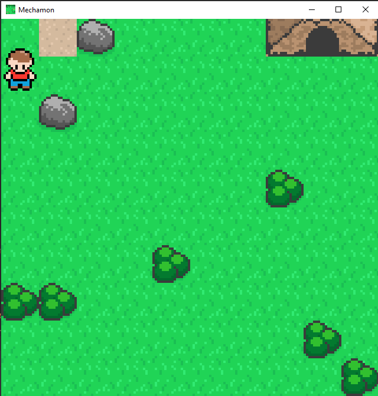

# Mechamon

Collect parts to battle bots

[](https://austinkucera.com/mechamon)

## Running

```
runJvm
runJs
jsBrowserDistribution
```


## Thoughts

add range to parts

target square outside of battle

target part inside battle

## Pushing to web

```
aws s3 rm s3://austinkucera.com/mechamon --recursive && aws s3 cp build/distributions/ s3://austinkucera.com/mechamon/ --recursive
```

## Credits

- [Zelda Like Tilesets and Sprites](https://opengameart.org/content/zelda-like-tilesets-and-sprites)
- [LPC Atlas Tiles](https://opengameart.org/content/lpc-tile-atlas)
- [Isaiah658's Pixel Pack](https://opengameart.org/content/isaiah658s-pixel-pack-2)